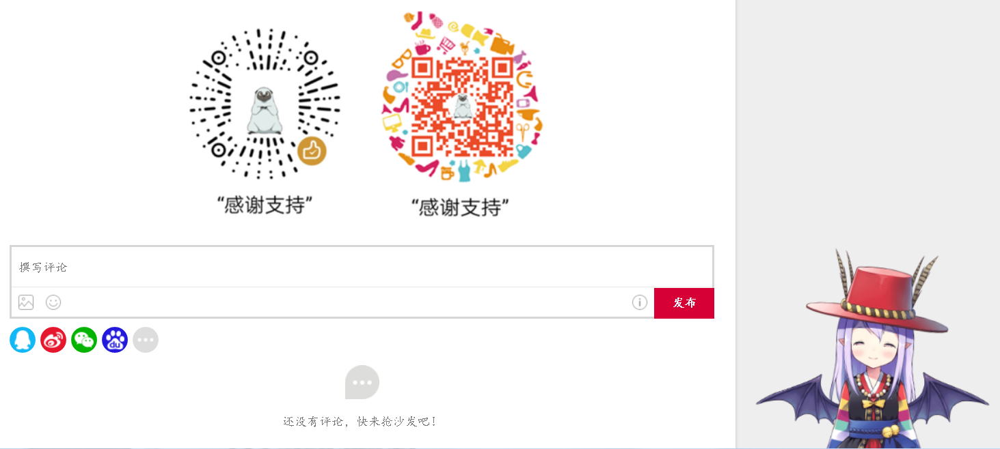
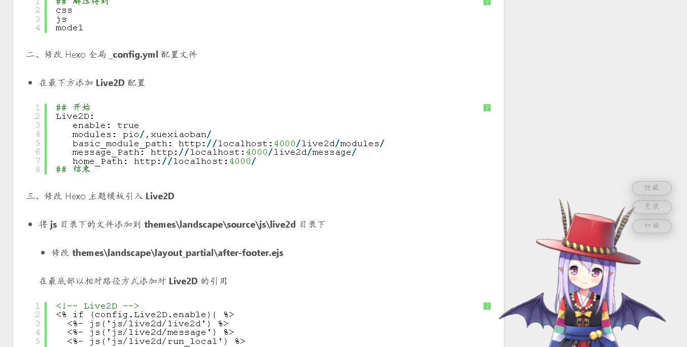

#### 添加 ICON

修改在 **themes/landscape** 目录下的 **_config.yml** 主题样式配置文件

将其中的 **favicon** 设置为 **/favicon.ico**

```python
# Miscellaneous
google_analytics:
gauges_analytics:
favicon: /favicon.ico
twitter:
google_plus:
fb_admins:
fb_app_id:
```

将自己的 **favicon.ico** 放到 **themes/landscape/source** 目录下即可

#### 添加 RSS

在 **_config.yml** 全局配置文件中有默认的 RSS 设置，默认留空。这时使用 Hexo 生成的 Feed 链接，需要先安装 **hexo-generator-feed** 插件。

```python
## 安装 hexo-generator-feed
cnpm install --save hexo-generator-feed
```

修改全局配置文件，在最后添加以下代码

```python
# RSS 订阅插件
feed: 
  type: atom
  path: atom.xml
  limit: 0

plugins: hexo-generate-feed
```

#### 添加阅读统计

添加 <a href="http://ibruce.info/2015/04/04/busuanzi/" target="_blank">不蒜子</a> 浏览数统计

 - 修改 **themes\landscape\layout\_partial\after-footer.ejs**

```xml
<% if (config.busuanzi_count.enable){ %>
<script async src="//busuanzi.ibruce.info/busuanzi/2.3/busuanzi.pure.mini.js"></script>
<% } %>
```

 - 在 **themes\landscape\layout\_partial\** 下，添加 **busuanzi_count.ejs**

```xml
<!-- busuanzi_count -->
<% if (config.busuanzi_count.enable){ %>
<span id="busuanzi_container_page_pv">
  本文总阅读量<span id="busuanzi_value_page_pv"></span>次
</span>
<% } %>
<!-- busuanzi_count -->
```

 - 修改 **themes\landscape\layout\_partial\** 下 **article.ejs**

 在 footer 标签尾部添加对 busuanzi_count.ejs** 的引用

```xml
    <footer class="article-footer">
      <a data-url="<%- post.permalink %>" data-id="<%= post._id %>" class="article-share-link"><%= __('share') %></a>
      <% if (post.comments && config.disqus_shortname){ %>
        <a href="<%- post.permalink %>#disqus_thread" class="article-comment-link"><%= __('comment') %></a>
      <% } %>
      <%- partial('post/tag') %>
      <%- partial('busuanzi_count') %>
    </footer>
```

 - 修改 **themes\landscape\layout\_partial\** 下 **footer.ejs**

```xml
<footer id="footer">
  <% if (theme.sidebar === 'bottom'){ %>
    <%- partial('_partial/sidebar') %>
  <% } %>
  <div class="outer">
    <div id="footer-info" class="inner">
      &copy; <%= date(new Date(), 'YYYY') %> <%= config.author || config.title %><br>
      <!-- busuanzi_count -->
      <% if (config.busuanzi_count.enable){ %>
      本站总访问量<span id="busuanzi_value_site_pv"></span>次
      本站访客数<span id="busuanzi_value_site_uv"></span>人次<br>
      <% } %>
      <!-- busuanzi_count -->
      <%= __('powered_by') %> <a href="http://hexo.io/" target="_blank">Hexo</a>
    </div>
  </div>
</footer>
```

#### 添加文章评论功能

NexT 支持的第三方的评论系统有很多，不过不少已经关闭不再可用了，而且对于国内来说比较友好的现在应该就只有<a href="https://livere.com" target="_blank">来必力</a>。

注册后点击导航上边的安装，选择免费的 city 版本.

 - 在 **themes\landscape\layout\_partial\** 下添加 **livere.ejs**

```xml
<!-- 来必力City版安装代码 -->
<div id="lv-container" data-id="city" data-uid="">
<script type="text/javascript">
   (function(d, s) {
       var j, e = d.getElementsByTagName(s)[0];

       if (typeof LivereTower === 'function') { return; }

       j = d.createElement(s);
       j.src = 'https://cdn-city.livere.com/js/embed.dist.js';
       j.async = true;

       e.parentNode.insertBefore(j, e);
   })(document, 'script');
</script>
<noscript> 为正常使用来必力评论功能请激活JavaScript</noscript>
</div>
<!-- City版安装代码已完成 -->
```

 - 修改 **themes\landscape\layout\_partial\article.ejs**

 在 footer 标签尾部添加对 **livere.ejs** 的引用

```xml
    <footer class="article-footer">
      <a data-url="<%- post.permalink %>" data-id="<%= post._id %>" class="article-share-link"><%= __('share') %></a>
      <% if (post.comments && config.disqus_shortname){ %>
        <a href="<%- post.permalink %>#disqus_thread" class="article-comment-link"><%= __('comment') %></a>
      <% } %>
      <%- partial('post/tag') %>
      <% if (!index){ %>
        <%- partial('livere') %>
      <% } %>
    </footer>
```

效果如下：



#### 添加文章目录

一、下载解压 **toc**

下载 <a href="/download/hexo-customer/toc.zip" target="_blank">toc.zip</a>

```python
## 解压得到
css
js
post
widget
```

二、修改 Hexo 主题

 - 将 **widget** 下的文件添加到 **themes\landscape\layout\_widget** 目录下

  - 修改 Hexo 主题配置文件 _config.yml

  在 Sidebar 后添加一个 toc

```python
# Sidebar
sidebar: right
widgets:
- category
- tag
- tagcloud
- archive
- recent_posts
- toc
```

 - 将 **post** 下的文件添加到 **themes\landscape\layout\_partial\post** 目录下

  - 修改 **themes\landscape\layout\_partial\article.ejs**

  在 `<%- post.content %>` 上面添加 `<%- partial('post/toc') %>`

```xml
    <div class="article-entry" itemprop="articleBody">
      <% if (post.excerpt && index){ %>
        <%- post.excerpt %>
        <% if (theme.excerpt_link){ %>
          <p class="article-more-link">
            <a href="<%- url_for(post.path) %>#more"><%= theme.excerpt_link %></a>
          </p>
        <% } %>
      <% } else { %>
        <%- partial('post/toc') %>
        <%- post.content %>
      <% } %>
    </div>
```

 - 将 **css** 下的文件添加到 **themes\landscape\source\css\_partial\post** 目录下

 - 修改 **themes\landscape\source\css\style.styl** 文件

  使用相对路径添加样式的导入

```css
@import "_partial/post/toc"
```

 - 将 **js** 下的文件添加到 **themes\landscape\source\js**目录下

  - 修改 **themes\landscape\layout\_partial\after-footer.ejs**

```xml
<!-- Toc -->
<%- js('js/toc') %>
<!-- Toc -->
```

#### 添加看板娘

一、下载解压 **live2d** 插件

看板娘插件 <a href="/download/hexo-customer/live2d.zip" target="_blank">live2d.zip</a>

```python
## 解压得到
css
js
model
```

二、修改 Hexo 全局 **_config.yml** 配置文件

 - 在最下方添加 **Live2D** 配置

```python
## 开始
Live2D: 
   enable: true ## 启用 Live2D
   modules: pio/,xuexiaoban/ ## 设置 live2d 模块模型
   basic_module_path: http://localhost:4000/live2d/modules/
   message_Path: http://localhost:4000/live2d/message/
   home_Path: http://localhost:4000/
## 结束
```

三、修改 Hexo landscape 主题模板引入 **Live2D**

 - 在 **themes\landscape\layout\_partial\live2d\** 目录下，添加 **live2d.ejs**

```xml
<!-- Live2D -->
<% if (config.Live2D.enable){ %>
<div id="landlord">
    <div class="message" style="opacity:0"></div>
    <canvas id="live2d" width="280" height="250" class="live2d" style="opacity:0;"></canvas>
    <div class="hide-button">隐藏</div>
    <div class="switch-button">变装</div>
    <div class="change-button">切换</div>
</div>
<script type="text/javascript">
    var nospecialtip = true;
    var nohitokoto = true;
    var modules = "<%- config.Live2D.modules %>".split(",");
    var basic_module_path = "<%- config.Live2D.basic_module_path %>";
    var live2d_Path = basic_module_path + modules[0];
    var message_Path = "<%- config.Live2D.message_Path %>";
    var home_Path = "<%- config.Live2D.home_Path %>";
</script>
<% } %>
<!-- Live2D -->
```

 - 修改 **themes\landscape\layout\_partial\footer.ejs**

  - 添加对 **live2d.ejs** 的引用。

```xml
<footer id="footer">
  <!-- live2d -->
  <%- partial('live2d/live2d') %>
  <!-- live2d -->
  <% if (theme.sidebar === 'bottom'){ %>
    <%- partial('_partial/sidebar') %>
  <% } %>
  <div class="outer">
    <div id="footer-info" class="inner">
      &copy; <%= date(new Date(), 'YYYY') %> <%= config.author || config.title %><br>
      <%= __('powered_by') %> <a href="http://hexo.io/" target="_blank">Hexo</a>
    </div>
  </div>
</footer>
```

 - 将 **js** 目录下的文件添加到 **themes\landscape\source\js\live2d** 目录下

  - 修改 **themes\landscape\layout\_partial\after-footer.ejs**

  在最底部以相对路径方式添加对 **Live2D** 的引用

```xml
<!-- Live2D -->
<% if (config.Live2D.enable){ %>
  <%- js('js/live2d/live2d') %>
  <%- js('js/live2d/message') %>
  <%- js('js/live2d/run_local') %>
<% } %>
<!-- Live2D -->
```

 - 将 **css** 目录下的文件添加到 **themes\landscape\source\css\live2d** 目录下

  - 修改 **themes\landscape\source\css\style.styl** 文件

  使用相对路径添加样式的导入

```css
@import "live2d/live2d"
```

 - 将 **model** 目录下的文件添加到 **themes\landscape\source\live2d** 目录下

四、启动 Hexo 查看效果

```python
## 本地启动 hexo
hexo s
```

访问 <a href="http://localhost:4000/" target="_blank">http://localhost:4000/</a> 查看效果



参考链接：

 - GitHub <a href="https://github.com/AlanDecode/Live2D-Typecho-Plugin" target="_blank">Live2D-Typecho-Plugin</a>

 - <a href="https://www.fghrsh.net/post/123.html" target="_blank">网页添加 Live2D 看板娘</a>

更多 live2d 模型下载 <a href="https://mx-model.ga/" target="_blank">梦象</a>
